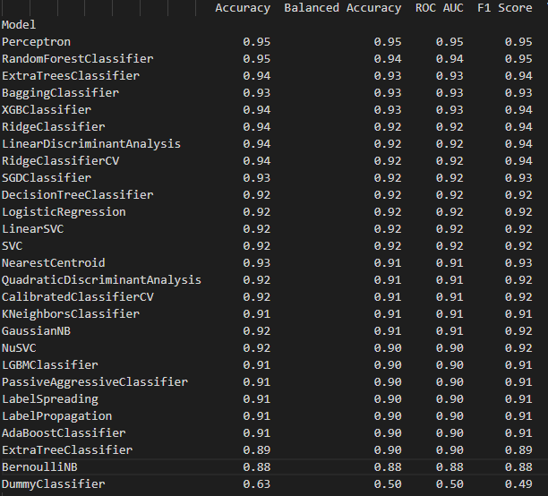
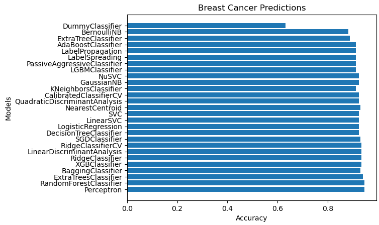

# LazyPredict
<h3>Lazy Predict is a new machine learning module which helps build a lot of basic models without much code and helps understand which models works better without any parameter tuning. You can apply a lot of machine learning algorithm at once just using a single module</h3> 

Official Github Repo: https://github.com/shankarpandala/lazypredict

Here, I have used the LazyPredict Framework on Breast Cancer Prediction Datasets and here is the result I have got:
 </img>  The Graph:   
</img>
